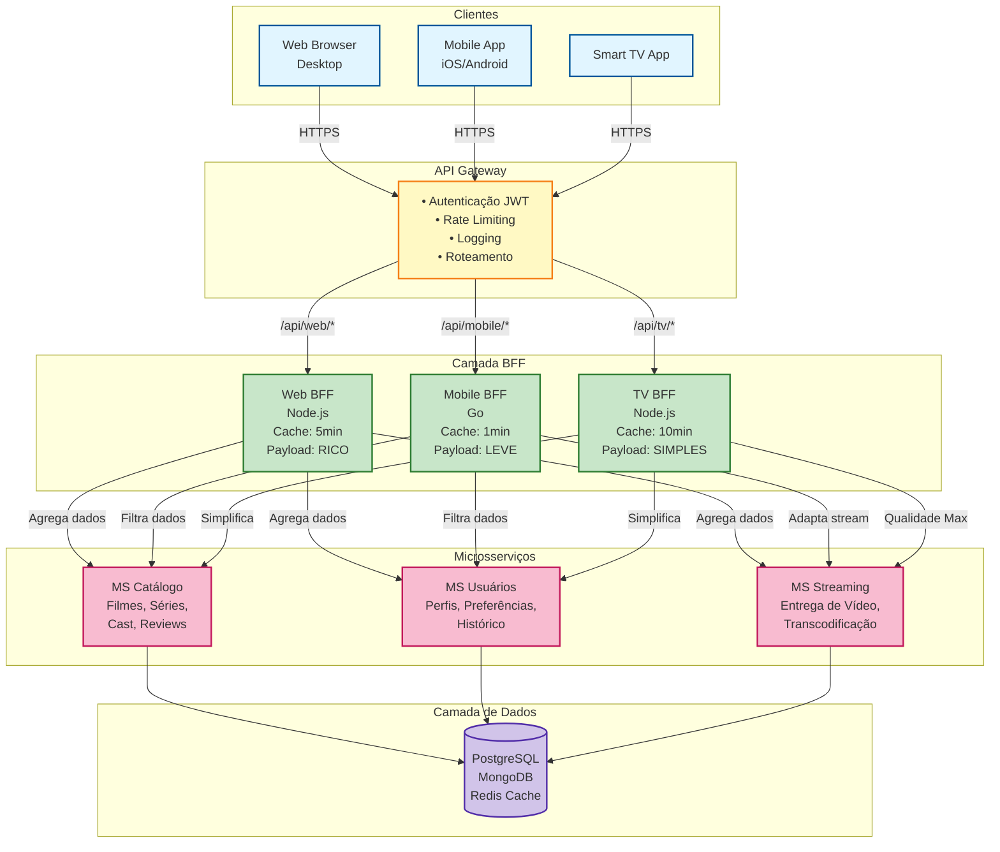
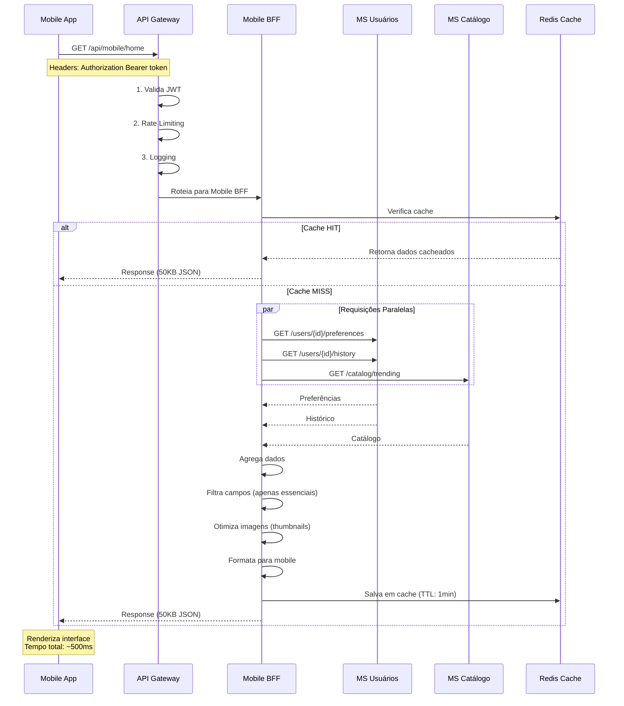
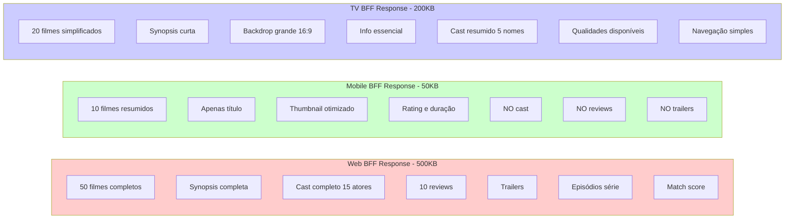
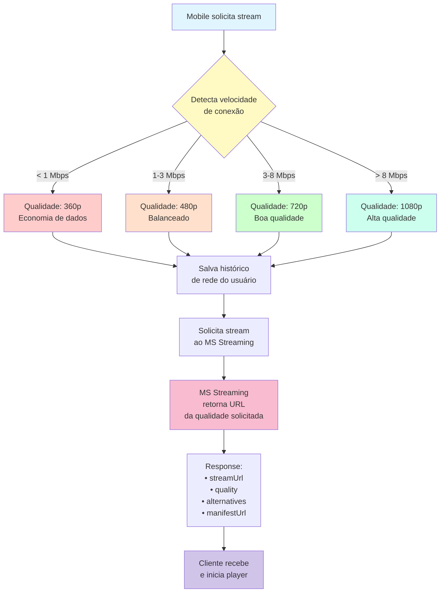
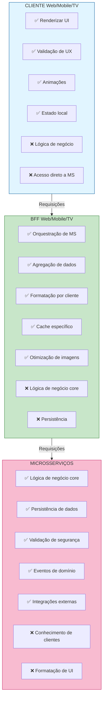

---

## Diagrama Detalhado: Fluxo de Requisição

---

## Diagrama: Comparação de Payloads

---

## Diagrama: Decisão de Qualidade de Stream (Mobile BFF)

---

## Diagrama: Distribuição de Responsabilidades

---

## Legenda de Cores

| Cor | Significado |
|-----|-------------|
| 🔵 Azul | Clientes (Web, Mobile, TV) |
| 🟡 Amarelo | API Gateway |
| 🟢 Verde | BFFs (Camada intermediária) |
| 🔴 Rosa | Microsserviços (Backend) |
| 🟣 Roxo | Banco de Dados |
