```mermaid
graph TB
    subgraph Clientes
        Web[Web Browser<br/>Desktop]
        Mobile[Mobile App<br/>iOS/Android]
        TV[Smart TV App]
    end

    subgraph API_Gateway[API Gateway]
        Gateway[• Autenticação JWT<br/>• Rate Limiting<br/>• Logging<br/>• Roteamento]
    end

    subgraph BFF_Layer[Camada BFF]
        WebBFF[Web BFF<br/>Node.js<br/>Cache: 5min<br/>Payload: RICO]
        MobileBFF[Mobile BFF<br/>Go<br/>Cache: 1min<br/>Payload: LEVE]
        TVBFF[TV BFF<br/>Node.js<br/>Cache: 10min<br/>Payload: SIMPLES]
    end

    subgraph Microsservicos[Microsserviços]
        MSCatalogo[MS Catálogo<br/>Filmes, Séries,<br/>Cast, Reviews]
        MSUsuarios[MS Usuários<br/>Perfis, Preferências,<br/>Histórico]
        MSStreaming[MS Streaming<br/>Entrega de Vídeo,<br/>Transcodificação]
    end

    subgraph Database[Camada de Dados]
        DB[(PostgreSQL<br/>MongoDB<br/>Redis Cache)]
    end

    Web -->|HTTPS| Gateway
    Mobile -->|HTTPS| Gateway
    TV -->|HTTPS| Gateway

    Gateway -->|/api/web/*| WebBFF
    Gateway -->|/api/mobile/*| MobileBFF
    Gateway -->|/api/tv/*| TVBFF

    WebBFF -->|Agrega dados| MSCatalogo
    WebBFF -->|Agrega dados| MSUsuarios
    WebBFF -->|Agrega dados| MSStreaming

    MobileBFF -->|Filtra dados| MSCatalogo
    MobileBFF -->|Filtra dados| MSUsuarios
    MobileBFF -->|Adapta stream| MSStreaming

    TVBFF -->|Simplifica| MSCatalogo
    TVBFF -->|Simplifica| MSUsuarios
    TVBFF -->|Qualidade Max| MSStreaming

    MSCatalogo --> DB
    MSUsuarios --> DB
    MSStreaming --> DB

    classDef clientStyle fill:#e1f5ff,stroke:#01579b,stroke-width:2px
    classDef gatewayStyle fill:#fff9c4,stroke:#f57f17,stroke-width:2px
    classDef bffStyle fill:#c8e6c9,stroke:#2e7d32,stroke-width:2px
    classDef msStyle fill:#f8bbd0,stroke:#c2185b,stroke-width:2px
    classDef dbStyle fill:#d1c4e9,stroke:#512da8,stroke-width:2px

    class Web,Mobile,TV clientStyle
    class Gateway gatewayStyle
    class WebBFF,MobileBFF,TVBFF bffStyle
    class MSCatalogo,MSUsuarios,MSStreaming msStyle
    class DB dbStyle
```

---

## Diagrama Detalhado: Fluxo de Requisição

```mermaid
sequenceDiagram
    participant Mobile as Mobile App
    participant Gateway as API Gateway
    participant MobileBFF as Mobile BFF
    participant MSUsers as MS Usuários
    participant MSCatalog as MS Catálogo
    participant Cache as Redis Cache

    Mobile->>Gateway: GET /api/mobile/home
    Note over Mobile,Gateway: Headers: Authorization Bearer token

    Gateway->>Gateway: 1. Valida JWT
    Gateway->>Gateway: 2. Rate Limiting
    Gateway->>Gateway: 3. Logging

    Gateway->>MobileBFF: Roteia para Mobile BFF
    
    MobileBFF->>Cache: Verifica cache
    alt Cache HIT
        Cache-->>MobileBFF: Retorna dados cacheados
        MobileBFF-->>Mobile: Response (50KB JSON)
    else Cache MISS
        par Requisições Paralelas
            MobileBFF->>MSUsers: GET /users/{id}/preferences
            MobileBFF->>MSUsers: GET /users/{id}/history
            MobileBFF->>MSCatalog: GET /catalog/trending
        end

        MSUsers-->>MobileBFF: Preferências
        MSUsers-->>MobileBFF: Histórico
        MSCatalog-->>MobileBFF: Catálogo

        MobileBFF->>MobileBFF: Agrega dados
        MobileBFF->>MobileBFF: Filtra campos (apenas essenciais)
        MobileBFF->>MobileBFF: Otimiza imagens (thumbnails)
        MobileBFF->>MobileBFF: Formata para mobile

        MobileBFF->>Cache: Salva em cache (TTL: 1min)
        MobileBFF-->>Mobile: Response (50KB JSON)
    end

    Note over Mobile: Renderiza interface<br/>Tempo total: ~500ms
```

---

## Diagrama: Comparação de Payloads

```mermaid
graph LR
    subgraph Web_BFF_Response[Web BFF Response - 500KB]
        W1[50 filmes completos]
        W2[Synopsis completa]
        W3[Cast completo 15 atores]
        W4[10 reviews]
        W5[Trailers]
        W6[Episódios série]
        W7[Match score]
    end

    subgraph Mobile_BFF_Response[Mobile BFF Response - 50KB]
        M1[10 filmes resumidos]
        M2[Apenas título]
        M3[Thumbnail otimizado]
        M4[Rating e duração]
        M5[NO cast]
        M6[NO reviews]
        M7[NO trailers]
    end

    subgraph TV_BFF_Response[TV BFF Response - 200KB]
        T1[20 filmes simplificados]
        T2[Synopsis curta]
        T3[Backdrop grande 16:9]
        T4[Info essencial]
        T5[Cast resumido 5 nomes]
        T6[Qualidades disponíveis]
        T7[Navegação simples]
    end

    style Web_BFF_Response fill:#ffcccc
    style Mobile_BFF_Response fill:#ccffcc
    style TV_BFF_Response fill:#ccccff
```

---

## Diagrama: Decisão de Qualidade de Stream (Mobile BFF)

```mermaid
flowchart TD
    Start[Mobile solicita stream] --> DetectSpeed{Detecta velocidade<br/>de conexão}
    
    DetectSpeed -->|< 1 Mbps| Quality360[Qualidade: 360p<br/>Economia de dados]
    DetectSpeed -->|1-3 Mbps| Quality480[Qualidade: 480p<br/>Balanceado]
    DetectSpeed -->|3-8 Mbps| Quality720[Qualidade: 720p<br/>Boa qualidade]
    DetectSpeed -->|> 8 Mbps| Quality1080[Qualidade: 1080p<br/>Alta qualidade]
    
    Quality360 --> SaveHistory[Salva histórico<br/>de rede do usuário]
    Quality480 --> SaveHistory
    Quality720 --> SaveHistory
    Quality1080 --> SaveHistory
    
    SaveHistory --> RequestMS[Solicita stream<br/>ao MS Streaming]
    
    RequestMS --> MSStreaming[MS Streaming<br/>retorna URL<br/>da qualidade solicitada]
    
    MSStreaming --> Response[Response:<br/>• streamUrl<br/>• quality<br/>• alternatives<br/>• manifestUrl]
    
    Response --> End[Cliente recebe<br/>e inicia player]

    style Start fill:#e1f5ff
    style DetectSpeed fill:#fff9c4
    style Quality360 fill:#ffcccc
    style Quality480 fill:#ffe0cc
    style Quality720 fill:#ccffcc
    style Quality1080 fill:#ccffee
    style MSStreaming fill:#f8bbd0
    style End fill:#d1c4e9
```

---

## Diagrama: Distribuição de Responsabilidades

```mermaid
graph TB
    subgraph Cliente[CLIENTE Web/Mobile/TV]
        C1[✅ Renderizar UI]
        C2[✅ Validação de UX]
        C3[✅ Animações]
        C4[✅ Estado local]
        C5[❌ Lógica de negócio]
        C6[❌ Acesso direto a MS]
    end

    subgraph BFF[BFF Web/Mobile/TV]
        B1[✅ Orquestração de MS]
        B2[✅ Agregação de dados]
        B3[✅ Formatação por cliente]
        B4[✅ Cache específico]
        B5[✅ Otimização de imagens]
        B6[❌ Lógica de negócio core]
        B7[❌ Persistência]
    end

    subgraph MS[MICROSSERVIÇOS]
        M1[✅ Lógica de negócio core]
        M2[✅ Persistência de dados]
        M3[✅ Validação de segurança]
        M4[✅ Eventos de domínio]
        M5[✅ Integrações externas]
        M6[❌ Conhecimento de clientes]
        M7[❌ Formatação de UI]
    end

    Cliente -->|Requisições| BFF
    BFF -->|Requisições| MS

    style Cliente fill:#e1f5ff,stroke:#01579b
    style BFF fill:#c8e6c9,stroke:#2e7d32
    style MS fill:#f8bbd0,stroke:#c2185b
```

---

## Legenda de Cores

| Cor | Significado |
|-----|-------------|
| 🔵 Azul | Clientes (Web, Mobile, TV) |
| 🟡 Amarelo | API Gateway |
| 🟢 Verde | BFFs (Camada intermediária) |
| 🔴 Rosa | Microsserviços (Backend) |
| 🟣 Roxo | Banco de Dados |
